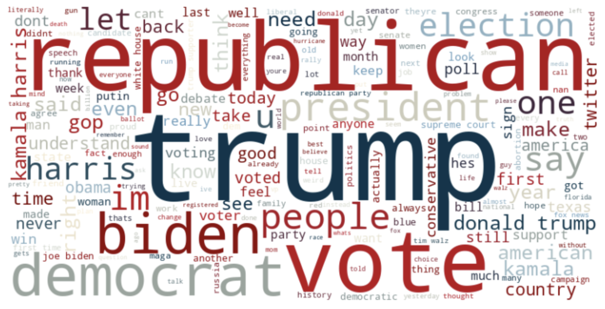

# Analyzing Political Discourse Tutorial

A step-by-step guide for analyzing political discourse using Python. This tutorial explores how sentiment analysis, word mapping, and information bubbles reveal insights into political behavior on platforms like Reddit.



## Features
- 🧠 **Sentiment Analysis**: Decipher emotional tones in political discussions.
- 🌐 **Word Mapping**: Visualize key themes and phrases with beautiful word clouds.
- 🔍 **Information Bubbles**: Dive into political echo chambers and explore segmentation.

## Installation
Get started in minutes:

1. Clone the repository:
   ```bash
   git clone git@github.com:AlanG2004/Analyzing-Political-Discourse-Tutorial.git

## Usage
Run the tutorial in Jupyter Notebook:
1. Launch Jupyter:
   ```bash
   jupyter notebook
   ```
2. Open the notebook:
   `Analyzing_Political_Discourse_Tutorial.ipynb`
3. Follow the instructions to analyze and visualize political discourse.
